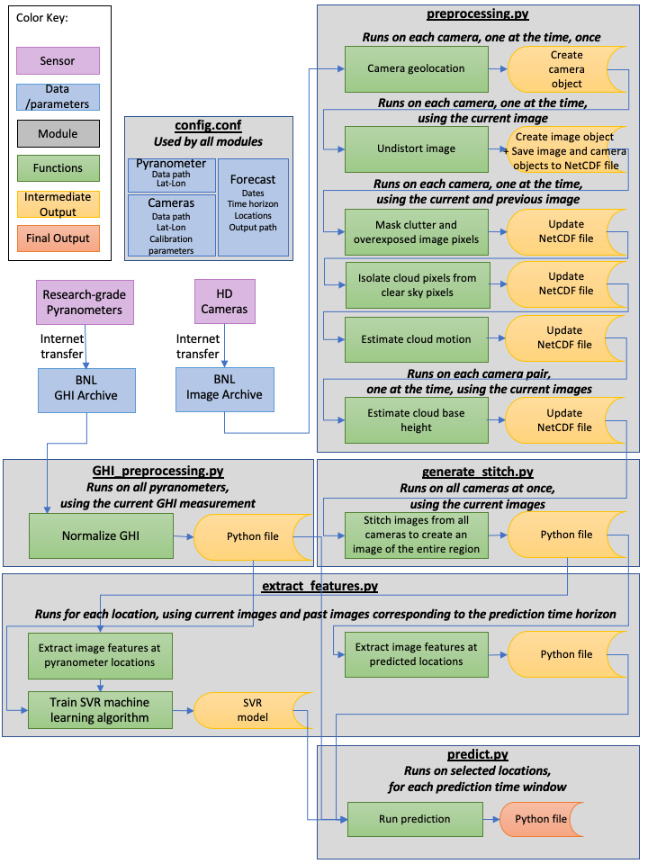

# SolarForecasting

## Project configuration

1. Install conda from the anaconda [site](https://www.anaconda.com/products/individual)
2. Open a terminal and check that conda is available
    - conda --version
3. Remove (base) from the terminal 
    - conda config --set auto_activate_base false
4. Create an environment for the project     
    - conda create -n solar python=3.5
5. Activate the environment    
    - conda activate solar
6. Upgrade pip    
    - pip install --upgrade pip
7. Install all dependencies  
    - conda install numpy pandas scipy matplotlib scikit-image ephem
    - conda install pytables -c conda-forge 
    - pip install rolling pyfftw sklearn pvlib
8. Edit the file config.conf file with your paths and number of processors. You can also select only one day, i.e. 201812019). Now you'll be able to run the code    
    - python preprocess.py    
    - python generate_stitch.py    
    - python extract_features.py
    - python predict.py

## Update: The rolling package is not compatible with stat_tools

1. Activate the environment    
    - conda activate solar
2. Remove the package 
    - pip uninstall rolling
3. Install cython
    - pip install cython
4. Install rolling (pointing to the 'rolling' folder provided) 
    - pip install rolling

## Update: netcdf4 is required

1. Install netcdf4
    - conda install netcdf4

